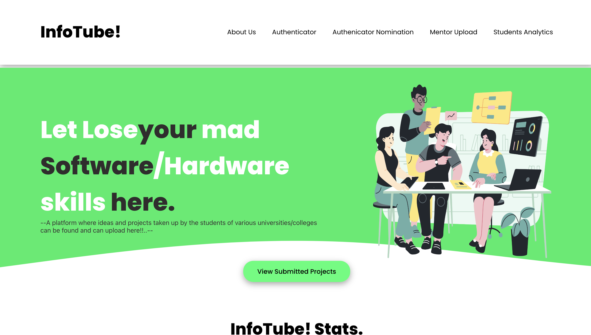

# Infotube (SIH2023)

## Overview

• As a part of Smart India Hackathon 2023, we selected a problem statement for developing a 'Online integrated platform for students to upload project details'. We developed this project and got selected for college level hackathon after clearing project presetation round.

## Project Details

- **Project Type:** Team Project
- **Role:** Team Leader, Frontend Developer

## Links

- [LinkedIn Project Update](https://www.linkedin.com/feed/update/urn:li:activity:7190759607982583808/)
- [GitHub Repository](https://github.com/Karthick1242004/Cognissance)

